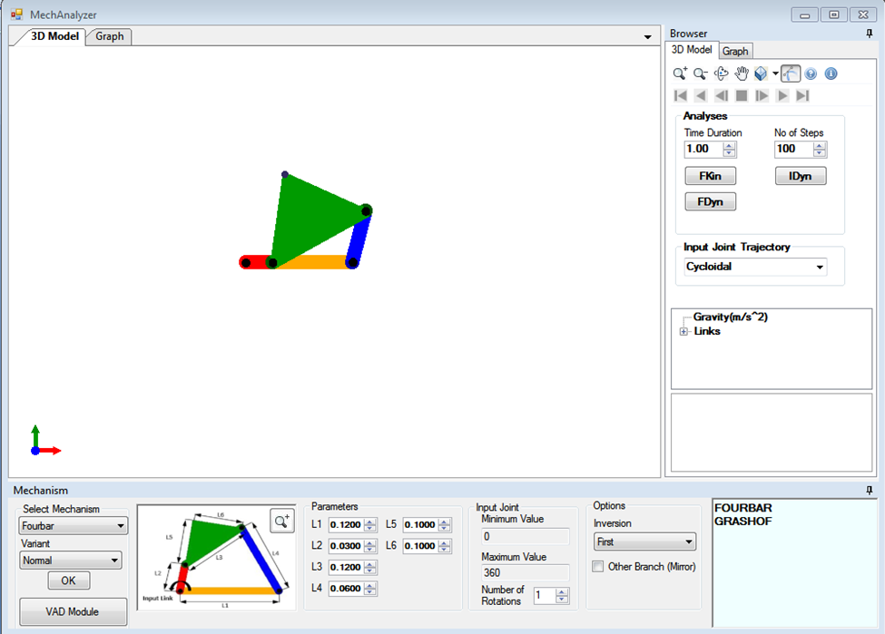
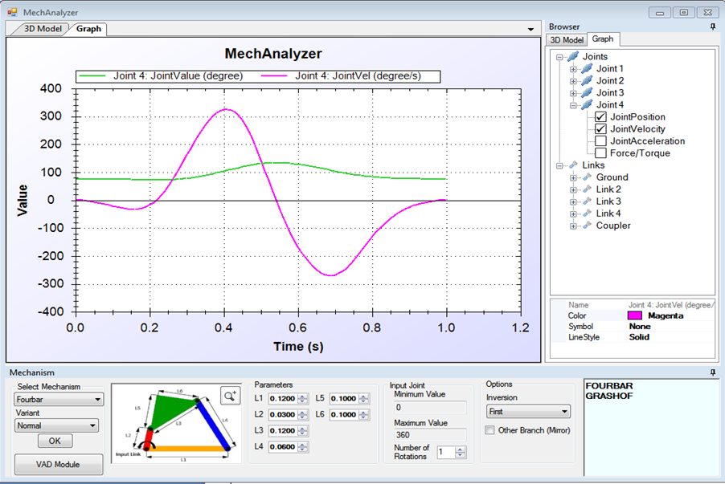
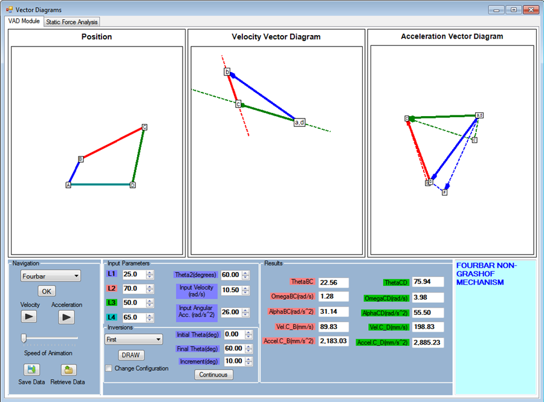
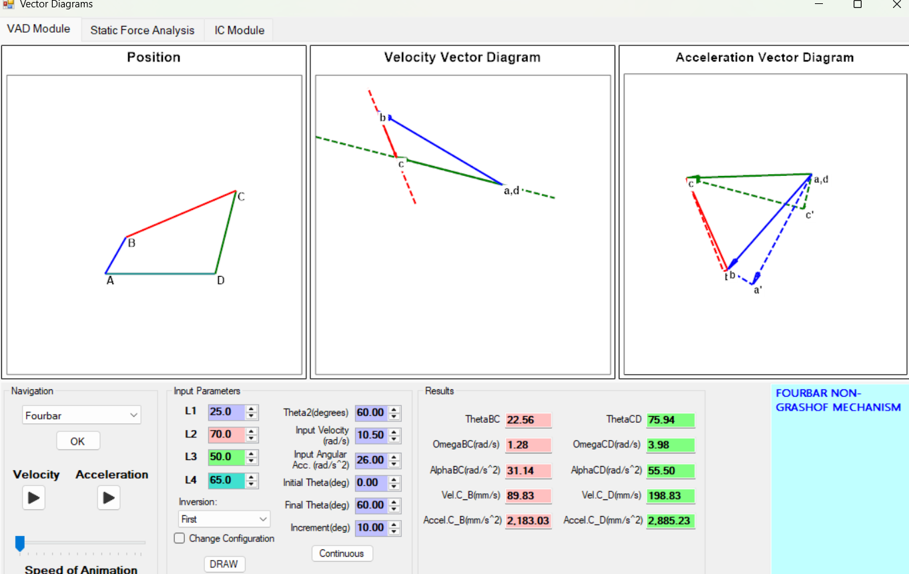
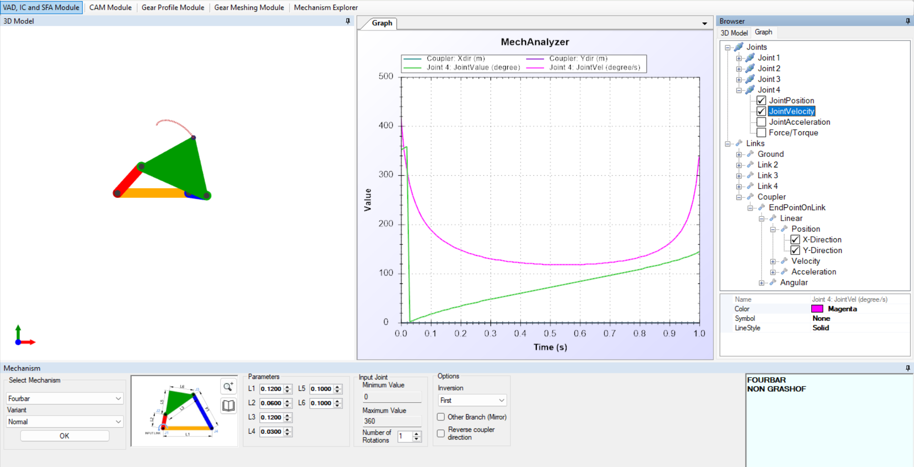

# Ex. No.  - SIMULATION ANALYSIS ON FOUR BAR CHAIN MECHANISM

## DATE: 14.12.2025

## AIM:

###   To determine & simulate the displacement & velocity analysis for the given four bar chain mechanism. 

###   In a four bar chain ABCD, AD is fixed and is 120 mm long. The crank AB is 30 mm long and rotates at 100 rpm clockwise, while the link CD = 60mm oscillates about D. BC and AD are of equal lengths. ∟BAD = 600.

## REQUIREMENTS:
###  ●	Mech Analyzer software.
###  ●	Processor: Minimum 1.5 GHz
###  ●	RAM: Minimum 512 MB
###  ●	Operating System: Windows XP, Windows Vista, Windows 7, Windows 8 or higher.
###  ●	Dependencies: Microsoft .Net 2.0 framework
###  ●	Mini Drafter.
###  ●	Geometry instruments.

## PROCEDURE:
###   1. Draw a horizontal line AD of length 120 mm. 
###   2. At A, Draw a line AB of length 30 mm at an angle of 600 
###   3. With B as centre, BC = AD = 120mm draw an arc 
###   4. With D as centre, CD = 60 mm draw another arc 
###   5. Join BC and DC 

###   This value of VBA is used to decide the scale for the velocity diagram 
###   Let us construct the velocity diagram taking a scale: 
###   0.3141 m/s = 60 mm (say) 
###   1. The fixed link AD, appears as a point in the velocity diagram 
###   2. From a, draw ab = 60mm, perpendicular to AB in configuration diagram and in the direction of velocity (downward direction) 
###   3. From b, draw vector bc perpendicular to BC
###   4. From (a,d), draw vector cd perpendicular to CD. This will intersect the previous vector at c.  

###   1. First measure cd from velocity diagram  
###   2. Now, Calculate VCd using the scale of the diagram 
###   3. Finally, calculate ωcd from the relation v = rω 
###   Thus, link CD revolves with ωcd = 4 rad/s (clockwise about D) 

## Output:

### Name:Yuvasri V
### Register Number:25008890 

## RESULT:
 ### Thus the displacement & velocity analysis for the given four bar chain mechanism is simulated.
